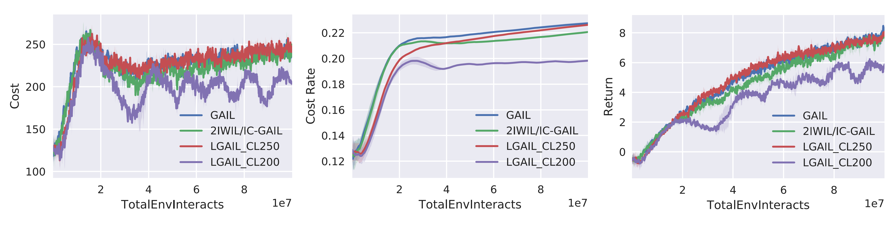

#### Learning curves of LGAIL on DoggoButton tasks
We provide two formats of the learning curves, and the '.pdf' version is in the higher resolution. The legend ''LGAIL_CL200'' means that the LGAIL experiments are conducted with the cost limit $d_0=200$, while ''LGAIL_CL250'' uses $d_0=250$. 

  </a>

