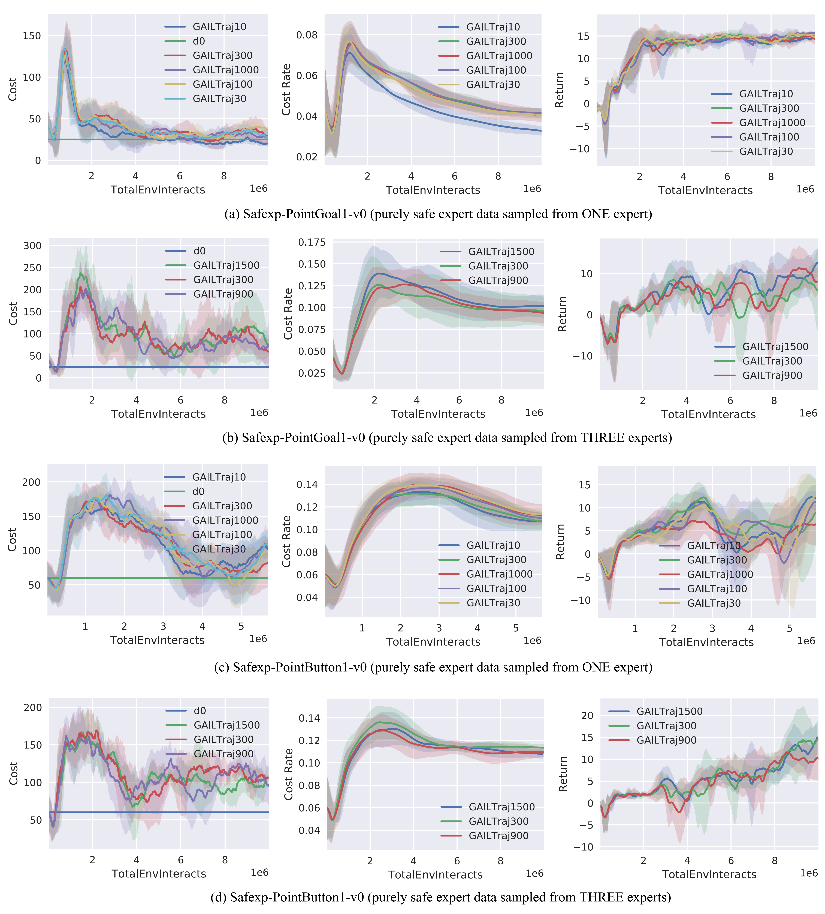

#### Learning curves of GAIL
We provide two formats of the learning curves, and the '.pdf' version is in the higher resolution. The legend ''GAILTraj{$x$}'' means that $x$ expert trajectories are used to train GAIL, and $d_0$ is the cost limit for the expert data. 

  </a>

